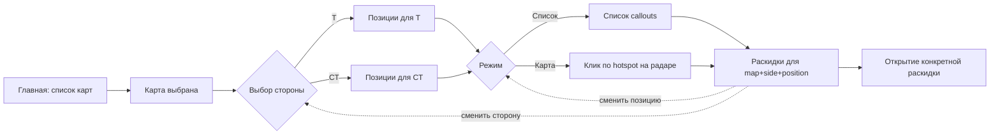

# План: выбор стороны и позиции в интерфейсе

> Стек проекта: Next.js 16 (App Router, Turbopack) + React 19 + Tailwind v4. Данные карт лежат в `src/data/maps.json`, типы — в `src/types/index.ts`, основная страница карты — `src/components/MapPageClient.tsx`. Координаты раскидок нормализованы в диапазоне `0..1`. Поле `side: 'T' | 'CT' | 'both'` у `Grenade` уже есть.

## 1. Цель
После выбора карты пользователь:
1. выбирает сторону (`T` / `CT`);
2. выбирает позицию (callout) — через **список** или **клик по радару**;
3. получает только релевантные раскидки для связки `map + side + position`.

## 2. Пользовательский флоу



## 3. Скоуп изменений (минимально-инвазивно)

Стараемся **не плодить** новые роуты, переиспользуя существующий `src/app/map/[mapId]/page.tsx` и расширяя `MapPageClient`.

### 3.1. URL-state (через query params)
- `/map/[mapId]` — старое поведение (если ничего не выбрано, по умолчанию `side` не задан → показываем экран выбора стороны).
- `/map/[mapId]?side=t` — выбрана сторона, экран выбора позиции.
- `/map/[mapId]?side=t&pos=long_doors` — выбрана позиция, выдаются только релевантные раскидки.
- `/map/[mapId]?side=t&pos=long_doors&g=<grenadeId>` — открыта конкретная раскидка.

Плюсы: deep-link, кнопка `Назад` в браузере работает естественно, можно делиться ссылкой.

### 3.2. Файлы, которые добавим

**Выбор стороны и позиций:**
- `src/types/positions.ts` — типы `Position`, `PositionCategory`.
- `src/data/positions.ts` — справочник позиций по картам/сторонам (callouts + hotspot-координаты).
- `src/components/SideSelector.tsx` — экран/оверлей выбора стороны.
- `src/components/PositionSelector.tsx` — экран выбора позиции (вкладки Список/Карта).
- `src/components/PositionList.tsx` — список callouts с поиском.
- `src/components/PositionRadar.tsx` — кликабельный радар с hotspot-зонами (на базе `useRadarImageBox`).
- `src/lib/positions.ts` — утилиты: `getPositionsByMapAndSide`, `findNearestPosition`, `attachPositionToGrenade`.

**Многоязычность (см. §16):**
- `src/i18n/index.ts` — словари и хук `useT()`.
- `src/i18n/dictionaries/{ru,en,uk}.ts` — переводы UI-строк.
- `src/components/LanguageSwitcher.tsx` — переключатель `RU/EN/UK`.

**Обучение по callouts (см. §17):**
- `src/app/callouts/page.tsx` — индекс карт.
- `src/app/callouts/[mapId]/page.tsx` — обучающая карта.
- `src/components/CalloutsTutorial.tsx` — клиентский компонент.

**Админка (см. §15):**
- `src/components/admin/AdminLineupsList.tsx` — таблица/сетка раскидок с поиском, фильтрами, статусами.
- `src/components/admin/AdminLineupForm.tsx` — выделить форму редактирования из `AdminMapClient`.
- `src/components/admin/AdminMediaPreview.tsx` — встроенный плеер MP4/iframe YouTube для превью.
- `src/lib/admin-history.ts` — undo/redo поверх `setAllLineups`.
- `src/lib/admin-validation.ts` — проверки заполненности (видео, описание, позиция).

### 3.3. Файлы, которые изменим
- `src/components/MapPageClient.tsx` — состояние `side` и `position` (через `useSearchParams`), условный рендер `SideSelector` → `PositionSelector` → текущий контент с раскидками; использует словари (§16).
- `src/components/FilterBar.tsx` — добавить «pill» текущей стороны/позиции с кнопкой сброса.
- `src/lib/lineups.ts` (или `grenades.ts`) — функция `filterByPosition(grenades, positionId)` (по `nearby_position_ids` или эвристика по дистанции до hotspot).
- `src/components/admin/AdminMapClient.tsx` — раскладка «карта + список + форма», hotkeys, undo/redo, мульти-селект `position_ids`, dirty-state и автосохранение черновика, превью медиа, дублирование, drag-маркеры.
- `src/types/index.ts` — `position_ids?: string[]` у `Grenade` и `CustomLineup`; локализованные поля `title_i18n?`, `description_i18n?` (см. §16).
- `src/app/layout.tsx` — провайдер i18n + чтение языка из cookie/`localStorage`.
- `src/app/page.tsx` — переключатель языка в шапке.

## 4. Модель данных

### 4.1. Тип `Position`
Добавим в `src/types/positions.ts`:

```ts
import type { Side } from './index'

export type PositionCategory =
  | 'spawn'      // T Spawn / CT Spawn
  | 'a_site'     // площадка A
  | 'b_site'     // площадка B
  | 'mid'        // мид и связки
  | 'rotation'   // переходы / coffins / connector / banana
  | 'utility'    // отдельные точки для ютилки

export interface PositionHotspot {
  /** Нормализованные координаты [0..1] на radar PNG */
  x: number
  y: number
  /** Радиус кликабельной зоны в нормализованных единицах (например 0.04) */
  radius?: number
  /** Какой слой радара (для Nuke — 'upper' / 'lower'); по умолчанию все */
  layer_id?: string
}

export interface Position {
  /** Стабильный slug, попадает в URL: `long_doors`, `apartments` */
  id: string
  /** Канонический англ. лейбл (callout) */
  label: string
  /** Локализованное имя (RU) */
  label_ru?: string
  /** Альтернативные названия в комьюнити (для поиска) */
  aliases?: string[]
  /** К какой стороне применима. `both` — и T, и CT (например, mid) */
  side: Side
  category: PositionCategory
  /** Привязка к карте: `de_dust2`, `de_mirage`, ... */
  map: string
  /** Геометрия hotspot для режима «Карта» */
  hotspot?: PositionHotspot
}
```

### 4.2. Привязка раскидок к позициям

Не трогаем существующие `Grenade` и `CustomLineup` радикально, а добавляем опциональное поле:

```ts
// src/types/index.ts
export interface Grenade {
  // ...
  /** ID позиций (callouts), к которым относится бросок (старт). Может быть несколько. */
  position_ids?: string[]
}
```

Если `position_ids` не задан, считаем позицию автоматически:
- берём `start_pos` (или ближайший `start_pos` из `throw_variants`);
- ищем ближайший `Position.hotspot` по евклидовой дистанции с порогом `radius`;
- кэшируем результат.

Это позволит **не переразмечать** все существующие раскидки руками.

## 5. UI

### 5.1. Экран выбора стороны (`SideSelector`)
- Подложка: радар выбранной карты (приглушённый).
- Две карточки в полную ширину (на мобильном — стек, на десктопе — рядом):
  - `T-side` — иконка/эмблема, цвет `#F0B429` или красно-оранжевый акцент.
  - `CT-side` — иконка, синий акцент.
- Кнопка `Назад` к списку карт.
- Подсказка: «Выбери, за какую сторону смотришь раскидки».

### 5.2. Экран выбора позиции (`PositionSelector`)
- Хедер: `Карта · Сторона`, иконка смены стороны.
- Tabs: `Фото` | `Список` | `Карта` (Фото — по умолчанию для новичков).
- **Фото (`PositionPhotos`) — visual spawn picker, см. §5.4:**
  - Сетка 2×N карточек со скриншотами локаций из CS2 (in-game).
  - Игрок появляется в раунде, видит свой ракурс → ищет такой же скриншот → тап.
  - Лучшее решение для новичков, не знающих callouts.
- **Список (`PositionList`):**
  - Поиск (по `label`, `label_ru`, `aliases`).
  - Группировка по `category`: Spawn → A → B → Mid → Rotations → Utility.
  - В каждой строке: callout, RU-название, счётчик раскидок.
  - Disabled-состояние, если для позиции нет раскидок (с пометкой `Скоро`).
- **Карта (`PositionRadar`):**
  - Радар с polygon/circle-hotspot’ами (SVG поверх ``).
  - Hover/active state, тултип с названием.
  - Авто-группировка близких hotspot’ов на маленьких экранах.
  - При клике — переход к выдаче раскидок.

### 5.4. Visual Position Picker (вкладка «Фото»)

> Идея: новичок не знает, как зовётся точка, на которой он появился. Но он **видит** перед собой ракурс из CS2. Если показать сетку скриншотов — он мгновенно опознает «свою» картинку.

#### a) Когда применяется

Любая категория позиций, особенно **Spawn**: после того, как игрок выбрал сторону (T/CT) и ткнул в `Spawn` (или вообще без шага `category` — на главном экране позиций), мы показываем сетку 4–8 фото с **разных стартовых точек спавна**. Например, на Mirage T-spawn: «возле скалы», «у стены», «у выхода в Apps», «у респаун-кубов». На каждом фото — слабая подпись callout снизу (для тех, кто хочет учить термины).

#### b) UX-сценарий

```
1. Игрок: «Открыл CS2, респавнился, держу ракурс».
2. В приложении: «Choose your side: T» → «Where do you start? Tap your view».
3. Сетка 2×4 скриншотов из игры → игрок узнаёт свой ракурс по первой секунде.
4. Тап → сразу переход к раскидкам с этой позиции (без промежуточного экрана).
```

Ключевое: **«узнал → ткнул → получил раскидки»** в 2 тапа от выбора стороны.

#### c) Структура данных

В `Position` добавляем опциональное поле `screenshot_url`:

```ts
export interface Position {
  // … остальные поля
  /**
   * URL скриншота локации из CS2 (in-game POV игрока, стоящего на этой точке).
   * Используется в визуальном picker'е (§5.4).
   * Размер: 640×360 WebP, ~70–120 КБ.
   */
  screenshot_url?: string
}
```

Хранятся в `public/positions/<map>/<side>/<position_id>.webp`.

#### d) Что показываем

- Минимум **4 скриншота** на стартовый экран — иначе скучно и нет разнообразия.
- Максимум **8** — иначе мелко, и приходится скроллить.
- Если у `category = spawn` слишком много мелких подпозиций — группируем (например, «возле колонны» и «у респаун-кубов» = одна общая позиция `t_spawn_near_apps`).

#### e) Куда лезет?

- Главный экран `PositionSelector` после выбора стороны — табы `Фото / Список / Карта`. **`Фото` — дефолт**.
- Альтернативно: после клика по `category = spawn` показывать сразу сетку скриншотов как **полноэкранный picker** (без табов), а если игрок захочет «другой способ» — там кнопка «Не вижу свою точку → по списку».

#### f) Acceptance criteria

- В `Position.screenshot_url` залит реальный in-game скрин (не радарный crop) для всех позиций категории `spawn` минимум на одной карте.
- Тап по картинке делает `router.push('/map/[mapId]?side=t&pos=<id>')` без промежуточных экранов.
- Если у позиции нет `screenshot_url` — карточка отображается с плейсхолдером 16:9 + лейбл + бейдж `Без фото`.
- Сетка адаптивна: 2 колонки на phone, 3 на tablet, 4 на desktop.
- Плотный layout: вся подпись (callout + RU-название) умещается в нижнюю плашку фото без переноса для < 18 символов.

#### g) Источник скриншотов

- **Свои:** заходим в CS2 (любая Workshop-карта или приватная игра), встаём на нужную точку, делаем `F12` (Steam) или `cl_drawhud 0; sv_cheats 1` + `PrtSc`. Подгоняем 16:9 кропом, экспорт WebP 640×360, ~80 КБ.
- **Чужие:** **нельзя** копировать с сайтов конкурентов. Только записи из своих демо или скриншоты собственных игр.

### 5.3. Экран раскидок (расширение текущего)
- В шапке два «pill» с текущим выбором: `T · Long Doors` и `×` для сброса.
- Текущий `FilterBar` (типы гранат) сохраняется.
- При смене позиции — список раскидок обновляется без полной перезагрузки.

## 6. Логика выдачи

```ts
// src/lib/positions.ts
export function filterGrenadesByPosition(
  grenades: Grenade[],
  side: Side,
  position: Position
): Grenade[] {
  return grenades
    .filter((g) => g.side === side || g.side === 'both')
    .filter((g) => belongsToPosition(g, position))
}
```

`belongsToPosition`:
1. Если у гранаты `position_ids?.includes(position.id)` → `true`.
2. Иначе — считаем дистанцию `start_pos` до `position.hotspot` (или ближайшего из `throw_variants`).
3. Возвращаем `true`, если дистанция ≤ `position.hotspot.radius` (по умолчанию `0.06`).

## 7. Каталог позиций (стартовый набор)

> Источник callouts — общеупотребимые сообществом термины (Liquipedia, Scope.gg, supercraft.host). Канонические — англ., в UI рядом — RU.

### 7.1. Dust2 (`de_dust2`)
- **Spawns:** T Spawn, CT Spawn.
- **A-side:** Long Doors, Long A, Pit, Goose, Blue, Ramp, Ninja, Car (A Short), Catwalk, Default Plant.
- **B-side:** Tunnels (Upper/Lower), Window, Door, Car (B), Back Plat, Fence.
- **Mid:** Top Mid, Xbox, Mid Doors, Lower Tunnels.

### 7.2. Mirage (`de_mirage`)
- **Spawns:** T Spawn, CT Spawn.
- **A-side:** Ramp, Palace, Stairs, Triple, Firebox, Ninja, Ticket, Default.
- **B-side:** Apartments, Kitchen, Market, Bench, Van, Short, Site.
- **Mid:** Top Mid, Window, Connector, Catwalk, Underpass.

### 7.3. Inferno (`de_inferno`)
- **Spawns:** T Spawn, CT Spawn.
- **A-side:** Apartments, Balcony, Pit, Graveyard, Arch, Library, Boiler, Default.
- **B-side:** Banana, Sandbags, Car, Coffins, Spools, 1st/2nd/3rd Orange, New Box.
- **Mid:** Top Mid, Mid (Second Mid), Porch, Ruins.

### 7.4. Nuke (`de_nuke`)
- **Upper:** Outside, Squeaky, Hut, Silo, Garage, Trophy, Heaven, Site A, Rafters.
- **Lower:** Lobby, Toxic, Site B, Vent, Big Box, Decon.
- **Spawns:** T Spawn, CT Spawn.
- ⚠ У Nuke 2 слоя radar — у hotspot указываем `layer_id`.

### 7.5. Overpass (`de_overpass`)
- **A-side:** Bathrooms, Connector, Sandbags, Truck, Default.
- **B-side:** Monster, Heaven, Banana, Short, Long, Tunnels, Party.
- **Mid:** Playground, Bridge, Fountain.

### 7.6. Anubis (`de_anubis`)
- **A-side:** Connector, Stairs, Heaven, Palace, Site A, Walkway.
- **B-side:** Canals, Bridge, Site B, Pit, Coffins.
- **Mid:** Mid, Top Mid, Water.

### 7.7. Ancient (`de_ancient`)
- **A-side:** Donut, Site A, Cave, Heaven, Pillar.
- **B-side:** Site B, Ruins, Stairs, Temple.
- **Mid:** Mid, House, Top Mid.

> Точные `hotspot.x/y/radius` подбираем по radar PNG (можно прямо в админке, см. §10).

## 8. Этапы внедрения

### MVP-1 — выбор стороны (≈ 0.5 дня)
- [ ] `SideSelector.tsx` (две большие карточки на radar-подложке).
- [ ] В `MapPageClient` читать `side` из `useSearchParams`. Если нет — показывать `SideSelector`.
- [ ] При выборе — `router.replace(?side=t|ct)`.
- [ ] Фильтрация списка раскидок: `g.side === side || g.side === 'both'`.
- [ ] Pill в шапке `T-side ×` (сброс возвращает к `SideSelector`).

**Критерии готовности:**
- На `/map/de_mirage` без `side` пройти к раскидкам нельзя.
- При `?side=t` показываются только T-side и `both` раскидки.
- Кнопка «Назад» в браузере возвращает на экран выбора стороны.

### MVP-2 — выбор позиции списком (≈ 1 день)
- [ ] `src/data/positions.ts` со стартовым набором по 3 картам (Mirage, Dust2, Inferno).
- [ ] `PositionList.tsx` (поиск + группы).
- [ ] `PositionSelector.tsx` без вкладки «Карта» (заглушка).
- [ ] `filterGrenadesByPosition` + эвристика «ближайший hotspot».
- [ ] Pill `T · Long Doors ×`.

**Критерии готовности:**
- После выбора позиции в списке URL содержит `?side=t&pos=long_doors`.
- Список раскидок ужимается до релевантных (пустой список → плашка «Нет раскидок»).
- Поиск находит позицию по русскому названию и aliases (`apps`, `апки`).

### MVP-3 — выбор позиции на радаре (≈ 1.5 дня)
- [ ] `PositionRadar.tsx` (SVG-overlay, hotspot’ы как `<circle>`).
- [ ] Tooltip с названием (на мобильном — long-press → показ).
- [ ] Учёт `layer_id` (для Nuke).
- [ ] Анимация подсветки выбранной точки.

**Критерии готовности:**
- Hotspot’ы корректно позиционируются при ресайзе окна и на разных aspect-ratio (тест на iPhone SE / iPad / desktop).
- На Nuke при переключении слоя меняется набор hotspot’ов.

### V2 — расширение и качество
- [ ] Полные callouts по всем 7 картам.
- [ ] Привязка `position_ids` через админку (см. §10).
- [ ] «Похожие позиции» при пустом результате.
- [ ] Аналитика: какие связки `map+side+position` чаще ищут (см. §12).

### V2-A — Удобная админка (≈ 2–3 дня, см. §15)
- [ ] Таблица/сетка раскидок с поиском и фильтрами (`AdminLineupsList`).
- [ ] Выделить форму в `AdminLineupForm`, добавить hotkeys (`S`, `Esc`, `Del`, `D`, `Cmd/Ctrl+Z`).
- [ ] Drag-and-drop маркеров и видео.
- [ ] Undo/redo, dirty-state, автосохранение черновика.
- [ ] Превью видео (YouTube/MP4) прямо в форме.
- [ ] Дублирование точки, шаблоны раскидок.
- [ ] Валидация заполненности и индикаторы статуса (Black / Yellow / Green).

### V2-I18N — Многоязычность (≈ 1–1.5 дня, см. §16)
- [ ] Базовая i18n-инфраструктура (RU/EN/UK).
- [ ] Локализация всего UI через словари.
- [ ] Локализованные поля контента (`title_i18n`, `description_i18n`, `Position.label_i18n`).
- [ ] Переключатель языка в шапке + сохранение выбора в cookie.
- [ ] SEO `<html lang>` и `og:locale`.

### V2-CALL — Обучающая страница «Callouts» (≈ 1 день, см. §17)
- [ ] Раздел `/callouts` — индекс карт.
- [ ] Страница `/callouts/[mapId]` — radar с подписями всех позиций.
- [ ] Фильтры по `side` / `category`.
- [ ] Карточка позиции при клике (callout + RU/UK + альтернативные названия + типичная роль).

## 9. Доступность и UX

- Кнопки выбора стороны/позиции — `<button>` с `aria-label`.
- Hotspot’ы должны быть достижимы через `Tab` (минимум 44×44 хитбокс).
- Контраст подложки radar при `SideSelector` — overlay `bg-black/60`.
- При сбросе позиции — фокус возвращается на `PositionSelector`.
- Поддержка нативной кнопки «Назад» (через URL-state).
- Long-press на мобильных для тултипа hotspot.

## 10. Админка: привязка раскидок к позициям

- В существующей админке (`src/app/admin/[mapId]`) при создании/редактировании lineup:
  - селект `side` (`T`/`CT`/`both`) — уже есть в типе.
  - **новое:** мульти-селект `position_ids` (берём из `getPositionsByMapAndSide`).
  - кнопка «Авто-привязка» — берёт ближайшую позицию по `start_pos`.
- В JSON-файле `custom-lineups.json` добавить поле `position_ids?: string[]`.

## 11. Edge cases

| Случай | Решение |
| --- | --- |
| `side: 'both'` граната | Показываем при любом выборе стороны. |
| Граната без `position_ids` и без `start_pos` | Показываем во всех позициях своей стороны (fallback) или прячем под флагом. |
| Nuke (2 слоя radar) | У позиции — `hotspot.layer_id`; при переключении слоя меняем набор. |
| Несколько `throw_variants` с разными стартами | Позиция считается по любому из стартов: совпадает → лайн-ап включён. |
| Маленький экран и плотные hotspot’ы (Mid) | На < 480px укрупняем хитбоксы и группируем близкие точки в кластер. |
| Нет раскидок для выбранной позиции | Плашка «Пока нет раскидок» + ссылки на 3 ближайшие позиции. |

## 12. Аналитика и тестирование

- Лог event’ов (минимум на клиенте, без бэкенда):
  - `side_selected { map, side }`
  - `position_selected { map, side, position, mode: 'list' | 'radar' }`
  - `lineup_opened { map, side, position, grenade_id }`
- Юнит-тесты на `filterGrenadesByPosition` и `findNearestPosition` (Vitest или встроенный, по проекту — сейчас тестов нет, можно добавить минимум).
- E2E (опционально): Playwright-сценарий «выбрал карту → сторону → позицию → открылась раскидка».

## 13. Риски

| Риск | Митигация |
| --- | --- |
| Разные callouts в комьюнити (`Apps` vs `Апки`) | `aliases[]` + поиск по нормализованной строке. |
| Hotspot’ы попадают мимо при разных aspect-ratio | Использовать существующий `useRadarImageBox` и нормализованные `0..1` координаты. |
| Существующие раскидки без `position_ids` | Эвристика «ближайшая позиция» + плановая разметка через админку. |
| Перегруз UI на маленьких экранах | Tabs «Список/Карта», bottom-sheet, кластеризация hotspot’ов. |
| URL-state ломает SSR | Использовать `useSearchParams` (клиентский), на сервере — рендер без выбора (нейтральное состояние). |
| Накладные расходы на 3 языка для контента | Делаем `*_i18n` опциональным; есть fallback на `en` → `ru` → legacy `title`. |
| Перевод устаревает быстрее кода | Подсветка непереведённых полей в админке + фильтр «Без EN-перевода». |
| Подписи callouts перекрывают друг друга | Ручная подгонка `hotspot` + опциональный де-оверлап алгоритм; на mobile — кластеризация. |
| «Очень удобная» админка увеличивает поверхность багов | Сначала рефакторим `AdminMapClient` на `AdminMapView + AdminLineupForm + AdminLineupsList`; покрываем недо-рефакторенные части ручным smoke-тестом по чек-листу из §15.3. |

## 14. Definition of Done (полный фичефлаг)

- На любой карте поток `карта → сторона → позиция → раскидки` работает на mobile и desktop.
- Все ссылки deep-linkable: можно открыть `?side=ct&pos=connector` сразу.
- Минимум 3 карты (Mirage / Dust2 / Inferno) полностью покрыты позициями.
- Админка позволяет привязывать раскидки к позициям (или работает авто-привязка).
- Нет регрессий: текущее поведение `/map/[mapId]` без query-параметров остаётся валидным (показывает выбор стороны).
- **Админка (§15)**: список + поиск + фильтры; добавление раскидки от пустой карты до сохранения занимает ≤ 60 секунд; есть hotkeys, undo, превью медиа.
- **Многоязычность (§16)**: переключение `RU/EN/UK` без перезагрузки; вся UI-разметка переведена; контент-поля редактируются на 3 языках в админке.
- **Callouts (§17)**: на `/callouts/[mapId]` отображаются подписи всех позиций для выбранной карты; ссылка на раздел доступна с главной.

---

## 15. Удобная админка (детально)

> Цель — сделать наполнение раскидками **очень быстрым и спокойным**. От открытия `/admin/[mapId]` до сохранённой готовой раскидки — ≤ 60 секунд (для типового кейса).

### 15.1. Текущее состояние (есть)
- Радар с маркерами кастомных и базовых раскидок (`AdminMapClient.tsx`).
- Добавление точки в один или два клика (приём → старт).
- Несколько вариантов броска в одну точку приёма.
- Загрузка медиа через `MediaFields` и `/api/admin/upload`.
- Сохранение в `custom-lineups.json`, скрытие seed-точек.

### 15.2. Что добавляем

#### a) Список/таблица раскидок (`AdminLineupsList`)
- Боковая панель/выдвижной список рядом с радаром.
- Колонки: `тип`, `название`, `сторона`, `позиции`, `статус` (см. §15.2.f), `источник` (моя/база), `последняя правка`.
- Поиск по `title`, `description`, `position.label`.
- Фильтры: `side`, `type`, `position`, `статус`, `только без видео`.
- Сортировка: «незаполненные сверху», «недавно изменённые», по карте.
- Клик по строке = выбор маркера на радаре (синхронизация выделения).

#### b) Hotkeys
| Клавиша | Действие |
| --- | --- |
| `N` | Новая точка (включить add-mode). |
| `Esc` | Снять выделение / выйти из add-mode. |
| `Del` / `Backspace` | Удалить выбранную точку. |
| `D` | Дублировать выбранную точку (новая копия рядом). |
| `S` / `Cmd+S` | Сохранить на сервер. |
| `Cmd/Ctrl+Z` / `Cmd/Ctrl+Shift+Z` | Undo / Redo (см. §15.2.d). |
| `1`..`4` | Сменить тип у выбранной (smoke / flash / molotov / he). |
| `T` / `C` / `B` | Сторона: T / CT / both. |
| `?` | Открыть оверлей со списком хоткеев. |

#### c) Drag-маркеров и медиа
- Перетаскивание маркера приёма и стартов варианта мышью/пальцем (работает поверх существующего `useRadarImageBox`).
- Snap-to-grid (опционально, шаг `0.005`).
- Видео/картинки можно **перетащить файлом** в форму (`drag-and-drop` в `MediaFields`) — автоматически грузится через `/api/admin/upload`.

#### d) Undo / Redo (`admin-history.ts`)
- Стек состояний `allLineups` (макс 50 шагов).
- Любое изменение (move, edit, delete, add) — push в стек.
- Шорткаты `Cmd+Z` / `Cmd+Shift+Z`.
- Тост `Возвращено: переместил приём`.

#### e) Dirty-state и автосохранение черновика
- При первом изменении — пометка `unsaved` на кнопке `Сохранить`.
- Автосохранение черновика в `localStorage` каждые 5 секунд (только для текущего map+layer).
- При открытии админки — предложение «Восстановить черновик от вчера».
- Подтверждение `beforeunload`, если есть несохранённые изменения.

#### f) Статусы заполненности (визуальные индикаторы)
| Статус | Условие | Маркер |
| --- | --- | --- |
| `Готова` | есть видео/гифка, описание, позиция, тип, сторона | зелёное кольцо |
| `Черновик` | есть точка, но нет видео или описания | жёлтое кольцо |
| `Пустая` | только координаты | красное кольцо |

В списке (§15.2.a) можно фильтровать по статусу. На радаре — мини-индикатор у маркера.

#### g) Превью медиа (`AdminMediaPreview`)
- В форме — встраиваемый плеер прямо в карточке варианта:
  - YouTube/Twitch/Streamable → `<iframe>`.
  - `.mp4`/`.webm` → `<video controls>`.
  - Картинка → ``.
- Кнопка `Открыть в новой вкладке`.
- Подсветка, если URL не парсится.

#### h) Дублирование и шаблоны
- Кнопка `Дублировать` (или `D`): копирует выбранную раскидку со сдвигом `+0.02` по X/Y.
- Шаблоны:
  - `T smoke A site` — пустые координаты + предзаполненная сторона/тип/категория позиции.
  - `CT molly банан` (для Inferno).
  - Хранятся в `src/data/admin-templates.json`, можно добавлять в админке.

#### i) Bulk-операции
- Чекбоксы в списке (§15.2.a).
- Действия: `Удалить`, `Сменить тип`, `Сменить сторону`, `Привязать позицию`.
- Undo/redo поддерживает bulk одним шагом.

#### j) Привязка позиций (callouts)
- Поле `position_ids: string[]` (мульти-селект из `getPositionsByMapAndSide`).
- Кнопка `Авто-привязка` — берёт ближайшую позицию по `start_pos` с порогом `radius`.
- Кнопка `Авто-привязка ВСЕМ без позиций` (bulk).

#### k) Импорт/экспорт
- Кнопка `Экспорт JSON` — скачивает `custom-lineups.json` целиком (бэкап).
- Кнопка `Импорт` — загружает JSON и делает `merge` (с предпросмотром изменений и подтверждением).
- Сохраняется история бэкапов в `data/backups/` на сервере (по дате).

#### l) Качество жизни
- Адаптивная двухколоночная раскладка: на десктопе `[список 320] [радар] [форма 360]`, на мобилке — табы.
- Тонкая полоса прогресса заполненности по карте: `52% (24/46 раскидок готовы)`.
- В заголовке map — счётчик `Готовы / Черновики / Пустые`.
- Кнопка `Перейти к карте` сохраняет состояние выбора при возврате.

### 15.3. Acceptance criteria для админки
- Поиск по `dust` показывает все Dust2-раскидки за < 100 мс.
- Выделение строки списка подсвечивает маркер на радаре и центрирует камеру.
- `Esc` → `N` → клик-клик по радару → ввод названия → `S` создаёт раскидку без перезагрузки.
- Случайное `Del` отменяется через `Cmd+Z`.
- Если у раскидки нет видео и описания — она помечена жёлтым в списке и на радаре.

---

## 16. Многоязычность (RU / EN / UK)

> CS2-аудитория глобальна. Поддерживаем три языка, при этом RU остаётся основным для внутренней разметки команды; EN — дефолт для не-RU/UK браузеров.

### 16.1. Принципы
- Локализуем **отдельно UI** и **отдельно контент**.
- UI — статические словари в коде (`src/i18n/dictionaries/{ru,en,uk}.ts`).
- Контент (названия раскидок, описания, лейблы позиций) — в JSON через `*_i18n: { ru, en, uk }`.
- Если перевод не задан — fallback в порядке `текущий → en → ru`.

### 16.2. Архитектура

#### a) Без `[locale]`-сегмента в URL (рекомендуем для MVP)
Чтобы не переписывать роутинг — храним язык в **cookie + `localStorage`** и отдаём словарь через React-провайдер. Стартовое определение:
1. Cookie `lang` (если уже выбирали).
2. `Accept-Language` от Next.js (через `headers()` в Server Component).
3. Дефолт `en`.

`<html lang>` ставим в `layout.tsx` динамически (`return <html lang={lang}>...`).

#### b) Опционально (V2.1) — `[locale]`-сегмент
`/[locale]/map/[mapId]` для SEO. Но это инвазивная переразметка — оставляем как этап V2.1.

### 16.3. UI-словари
Пример `src/i18n/dictionaries/ru.ts`:

```ts
export const ru = {
  home: {
    pickMap: 'Выбери карту',
    soon: 'Скоро',
    grenadesCount: '{count} раскидок',
  },
  side: {
    title: 'Выбери сторону',
    t: 'Терры',
    ct: 'Спецы',
    hint: 'Сторона влияет на доступные позиции и раскидки',
  },
  position: {
    pickPosition: 'Выбери позицию',
    list: 'Список',
    map: 'Карта',
    search: 'Поиск позиции',
  },
  // ...
}
```

Хук `useT()`:

```ts
const t = useT()
t('side.title') // → 'Выбери сторону' / 'Choose side' / 'Обери сторону'
```

### 16.4. Контент-поля
Расширяем типы:

```ts
export type Localized<T = string> = Partial<Record<'ru' | 'en' | 'uk', T>>

export interface CustomLineup {
  // ...
  title: string                // legacy — будет читаться как fallback
  title_i18n?: Localized
  description: string
  description_i18n?: Localized
}

export interface Position {
  // ...
  label: string
  label_i18n?: Localized
}
```

Helper:

```ts
export function pickLocalized<T>(
  field: Localized<T> | undefined,
  legacy: T | undefined,
  lang: 'ru' | 'en' | 'uk',
): T | undefined {
  return field?.[lang] ?? field?.en ?? field?.ru ?? legacy
}
```

### 16.5. Админка и переводы
- В форме раскидки (`AdminLineupForm`) для `title` и `description` — табы `RU / EN / UK`.
- Подсветка незаполненных языков (badge `+EN`).
- Кнопка `Скопировать из RU` для быстрого старта перевода.
- Маркер «Перевод неполный» в списке (§15.2.f), фильтр `Без EN-перевода`.

### 16.6. Что переводим обязательно
- Вся UI-разметка (кнопки, заголовки, подсказки).
- Стороны (`T-side` / `CT-side`).
- Названия типов гранат (Дым/Smoke/Дим).
- `Position.label_i18n` (RU/UK поверх англ. callout).
- Названия карт можно оставить английскими — это конвенция CS2 (`Mirage`, `Dust II`).

### 16.7. SEO и edge cases
- `<html lang="...">` в `layout.tsx`.
- Мета `og:locale` подстраивается под выбранный язык.
- Поиск (§5.2) по позициям ищет одновременно во всех языках + `aliases`.
- При отсутствии перевода у конкретной раскидки — показываем оригинал и значок `(RU)`.

### 16.8. Acceptance criteria
- Переключение языка в шапке мгновенно меняет UI без F5.
- В админке у `Long Doors` можно задать `Длинные двери` (RU) и `Довгі двері` (UK).
- На главной браузер с `Accept-Language: uk-UA` открывается на украинском.
- Поиск по `апки` находит позицию с `aliases: ['апки', 'апи', 'apartments']`.

---

## 17. Обучающая страница «Callouts» (имена позиций)

> Многие игроки на низких рангах не знают, как называются точки. Делаем отдельный раздел, который **переиспользует** наш справочник позиций (§4.1).

### 17.1. Роутинг
- `/callouts` — индекс карт (как `/`, но с заголовком «Имена позиций»).
- `/callouts/[mapId]` — карта с подписями всех позиций.
- Доступ из главной — кнопка/пилюля `📚 Callouts` рядом с `Выбор карты`.

### 17.2. UI

#### a) Карта с подписями
- Полноэкранный radar.
- Поверх — SVG с `circle` + `text` для каждой `Position`:
  - подпись на текущем языке (RU/EN/UK);
  - размер шрифта зависит от плотности (на mobile — крупнее, на desktop — компактнее);
  - цвет подписи — по `category` (A=жёлтый, B=зелёный, Mid=синий, Spawn=серый, Rotation=фиолетовый).
- Лёгкое затемнение radar для читаемости.

#### b) Фильтры
- Toggle `T-side / CT-side / Все`.
- Toggle категорий (`A`, `B`, `Mid`, `Spawn`, `Rotation`).
- Слой radar (для Nuke).
- Поиск с автоскроллом-зумом к найденной позиции.

#### c) Карточка позиции (клик/тап)
- Callout (англ.).
- Локализованное имя (RU / UK).
- Альтернативные названия (`aliases`) — «как ещё могут позвать».
- Краткое описание роли: «Точка обычно держится одним игроком CT в начале раунда».
- Кнопка `Смотреть раскидки сюда` → переводит на `/map/[mapId]?side=ct&pos=connector`.

#### d) Режим «Викторина» (V2-CALL+)
- На radar показываются точки без подписей.
- Игрок угадывает имя — мультивыбор из 4 вариантов.
- Цель — закрепить terminology.

### 17.3. Источник данных
- Полностью переиспользуем `src/data/positions.ts` (§4.1).
- Никакого нового справочника — это гарантирует, что в раскидках, в выборе позиции и в обучении используются **одни и те же** callouts.

### 17.4. Связка со страницей карт
- На странице раскидок (`MapPageClient`) кнопка `?` рядом с pill позиции открывает оверлей с callouts данной карты.
- Из оверлея можно перейти в полноэкранный `/callouts/[mapId]`.

### 17.5. Acceptance criteria
- На `/callouts/de_mirage` видны минимум 12 подписей (Apps, Connector, Top Mid, Window, Ramp, Palace, Stairs, Triple, Ticket, Jungle, B Site, Market).
- На мобильном подписи не пересекаются на стандартных позициях (есть простой algorithm de-overlap или ручная подгонка `hotspot.y` для близких точек).
- Из карточки позиции по `Смотреть раскидки сюда` сразу попадаем на нужный экран с уже выбранной стороной и позицией.
- Раздел переведён на RU / EN / UK.
