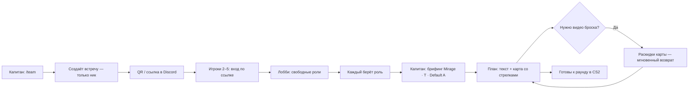

# План: командная «Тактика» — групповые раунды и раздача ролей

> Документ-спутник к `PLAN_SIDE_SELECTION_UI.md` и `CONTENT_AND_MEDIA_CHECKLIST.md`.
>
> Стек: Next.js 16 (App Router, Turbopack) + React 19 + Tailwind v4. Данные пока в JSON, без бэкенда. Поля `Grenade.position_ids`, `side`, `media_url` и поток `карта → сторона → позиция → раскидка` уже спланированы.

## 0. TL;DR

1. Делаем **«Тактику»** как самостоятельный раздел `/team` — поверх уже спланированной фичи выбора стороны/позиции.
2. **Сначала группа, потом карта и тактика**: создание встречи = только ник + ссылка/QR. Карта, сторона и конкретная тактика выбираются **после** того, как команда собралась и разобрала роли (экран «брифинг» у капитана / голосование).
3. **MVP-T0 — без сервера**: локальные встречи, роли, план по шагам, соло-превью. **MVP-T1** — Supabase realtime. **MVP-T1.5** — тактическая карта со стрелками и мгновенный мост «тактика ↔ раскидки» на выбранной карте.
4. Каждый шаг `throw` — **ссылка на раскидку** (`grenade_id`) + опционально точка на радаре. Переход в `/map/[mapId]` и обратно в `/team/[code]` — **без полной перезагрузки** (prefetch + общий контекст сессии + sticky dock).
5. План игрока = **два режима**: текстовый timeline (уже есть) и **карта** (маршруты по ролям, слой «вся команда» / «моя роль», маркеры бросков). Игроки должны видеть **глобальную цель** раунда, не только свой список шагов.
6. Стартовая библиотека в `src/data/tactics.json` — с полями `path[]` на шагах и блоком `tactic_overview` для общей картины.

> **Статус кода (май 2026):** реализован MVP-T0 с упрощённым флоу «карта+сторона+тактика при создании». Следующий спринт — **рефакторинг под §0.1** (группа → роли → брифинг → план/карта).

---

## 0.1. Ревизия флоу: группа → роли → карта и тактика

### Почему меняем порядок

| Было (MVP-T0) | Стало (целевой продукт) |
| --- | --- |
| Капитан при создании сразу выбирает Mirage · T · «Default A» | Капитан создаёт **пустую встречу** (код + QR), друзья заходят |
| Игроки подключаются уже к «зашитой» карте | Сначала **лобби + выбор ролей** на нейтральном экране |
| Смена карты = новая встреча | Карта/сторона/тактика — **настройка раунда** внутри той же встречи |

Логика CS2: сначала собираете пятерку и роли, потом IGL говорит «играем Mirage, full-buy, дефолт на A».

### Целевой пайплайн

```mermaid
flowchart TD
    A[Главная /team] --> B[Создать встречу: только ник]
    B --> C[/team/AB12 — лобби + QR]
    C --> D[Каждый: ник → выбор роли]
    D --> E{Капитан: все роли заняты?}
    E -->|Нет| C
    E -->|Да| F[Брифинг: карта → сторона → тактика]
    F --> G[План: текст + карта + раскидки]
    G --> H[/map/de_mirage с meet-контекстом]
    H -->|Мгновенно назад| G
```

### Новые экраны `MeetScreen`

```ts
type MeetScreen =
  | 'nickname'   // первый вход: как кликать
  | 'lobby'      // QR, список ролей, ожидание
  | 'picker'     // выбор своей роли
  | 'briefing'   // капитан (или голос): карта · сторона · тактика
  | 'plan'       // текстовый план + вкладка «Карта»
  | 'lineups'    // опционально: встроенный слой раскидок без ухода с /team
```

### Модель `Meet` (изменения)

```ts
interface Meet {
  code: string
  secret: string
  /** null до брифинга — встреча ещё не привязана к карте */
  map: string | null
  side: Side | null
  tactic_id: string | null
  briefing_locked: boolean   // капитан нажал «Зафиксировать»
  members: MeetMember[]
  created_at: string
  expires_at: string
}
```

Капитан на `briefing` видит те же пилюли карт/сторон/тактик, что сейчас в `QuickCreateSheet`, но **после** лобби. Игроки в лобби видят «Капитан выбирает карту…», затем «Mirage · T · Default A».

---

## 1. Цель и сценарий

### 1.1. Кейс «вечер пятницы, 5 человек в Discord»



### 1.2. Что получает каждый игрок на экране

```
┌──────────────────────────────────────────┐
│  Mirage · T-side · Lurker                │   ← хедер
│  Тактика: «T Default A»     [Сменить]    │
├──────────────────────────────────────────┤
│  ⏱ 0:00  Spawn → закуп AK + флешка       │
│  ⏱ 0:10  Бежим на Mid через коннектор    │
│  ⏱ 0:20  Стенд на B Apps, ждём смок A    │
│  ⏱ 0:30  Смок «Окно» 🎬                   │   ← тап = видео
│         ↳ задача: лурк через апки        │
│  ⏱ 0:45  Флеш на B и пик                  │
│  ⏱ 1:10  Если +1 → ротация на A          │
│                                          │
│  [✓ Готов]   [⟲ Раунд начат]  [↻ Заново] │
└──────────────────────────────────────────┘
```

### 1.3. Зачем это вообще

- **Низкие ранги** не знают калауты, роли и стандарты. Тактика на телефоне = поднимает уровень игры в команде на 1–2 ранга без напряга.
- Уже есть библиотека раскидок — встраиваем её в план **без копипасты**: «бросок» в шаге = ссылка на конкретный `grenade_id`.
- Высокая вовлечённость: чтобы пользоваться тактиками, друзей **обязаны** позвать в приложение → виральный рост.

---

## 2. Терминология (CS2-friendly)

Чтобы UI говорил на языке игроков:

| Термин в коде | UI (RU) | UI (EN) | Описание |
| --- | --- | --- | --- |
| `Meet` (встреча) | Сходка / Игра | Match | Одна сессия команды на одну карту |
| `RoomCode` | Код встречи | Room code | Короткий код `AB12` для подключения |
| `Role` | Роль | Role | Entry / AWP / Lurker / Support / IGL / Anchor A / Anchor B |
| `Tactic` | Тактика | Tactic | Шаблон поведения команды на раунд |
| `RolePlan` | План роли | Role plan | Что именно делает 1 человек за раунд |
| `Step` | Шаг | Step | Один пункт плана (move / hold / throw / peek …) |
| `LineupRef` | Раскидка | Lineup | Ссылка на `grenade_id` из библиотеки |

### 2.1. Каноничные роли

```ts
export type TeamRole =
  | 'igl'         // капитан, командует
  | 'entry'       // первым залетает
  | 'awp'         // снайпер
  | 'lurker'      // одиночка, играет за спиной у CT
  | 'support'     // ютилка, прикрывает entry
  | 'anchor_a'    // CT — держит A
  | 'anchor_b'    // CT — держит B
```

> На T-стороне обычно: `igl + entry + awp + lurker + support`. На CT: `igl + awp + anchor_a + anchor_b + support` (или две поддержки + ротатор). UI это знает и предлагает корректные роли по `side`.

---

## 3. Модель данных

### 3.1. Тактика и шаги

```ts
// src/types/tactics.ts
import type { Side } from './index'

export type StepKind =
  | 'spawn'   // на спавне: купи / возьми ютилку
  | 'move'    // двигаемся отсюда туда
  | 'hold'    // стоим, держим угол
  | 'throw'   // бросок гранаты
  | 'peek'    // выглядываем
  | 'exec'    // одновременный экзек площадки
  | 'rotate'  // ротация по информации
  | 'note'    // произвольная заметка / напоминание

export interface TacticStep {
  id: string
  /** Время в секундах от старта раунда (115 сек). Опционально. */
  time?: number
  kind: StepKind
  /** Короткий человекочитаемый текст: «Бежим в коннектор», «Хольд апсика». */
  text: string
  /** ID позиции из справочника §4.1 плана UI (callout). */
  position_id?: string
  /** Если шаг — бросок, тут id из библиотеки раскидок. */
  grenade_id?: string
  /** Маршрут на радаре: набор точек 0..1. Для V2-визуализации. */
  path?: { x: number; y: number }[]
}

export interface RolePlan {
  role: TeamRole
  /** Краткое описание роли в этой тактике («Лурк через апки, ловит CT-ротацию»). */
  brief: string
  steps: TacticStep[]
}

export interface Tactic {
  id: string
  map: string                 // 'de_mirage'
  side: Side
  name: string                // 'T Default A'
  description: string
  /** Под какие раунды: pistol / eco / force / full-buy / any. */
  scenario: 'pistol' | 'eco' | 'force' | 'full' | 'any'
  /** План для каждой роли. Может быть не на всех 5 — это норм. */
  role_plans: RolePlan[]
  source: 'preset' | 'custom'
  author?: string
  created_at: string
}
```

### 3.2. «Встреча» (Meet) и участники

```ts
// src/types/meet.ts
import type { Side, TeamRole } from './index'

export interface MeetMember {
  /** Анонимный clientId (UUID), сохраняется в localStorage. */
  id: string
  nickname: string
  role: TeamRole | null
  is_captain: boolean
  joined_at: string
  /** Для presence (онлайн/офлайн), MVP-T1+. */
  last_seen?: string
}

export interface Meet {
  /** Короткий код «AB12» (4 символа base32-без-неоднозначных-букв). */
  code: string
  map: string
  side: Side
  /** Какую тактику выбрал капитан. */
  tactic_id: string | null
  members: MeetMember[]
  created_at: string
  /** Авто-удаление через 4 часа после последнего обновления. */
  expires_at: string
}
```

### 3.3. Где это хранится

| Этап | Где живут данные |
| --- | --- |
| MVP-T0 (без бэка) | Тактика и встреча целиком кодируются **в URL** (`?meet=...` — base64 от gz-сжатого JSON) или в **localStorage** капитана. Тиммейты получают встречу через ссылку и хранят её локально. |
| MVP-T1 (Supabase) | Таблицы `tactics`, `meets`, `meet_members` в Postgres. Realtime через Supabase Channels. |
| MVP-T2 | + Кастомные тактики, голосование, история раундов. |

---

## 4. Скоуп файлов

### 4.1. Что добавляем

**Тактика и встречи:**

- `src/types/tactics.ts` — типы выше.
- `src/types/meet.ts` — типы встречи.
- `src/data/tactics.json` — стартовая библиотека пресет-тактик (см. §11).
- `src/data/role-presets.ts` — словарь ролей: иконка, цвет, доступность по `side`.
- `src/lib/tactics.ts` — `getTactics`, `getTacticsByMapAndSide`, `getTacticById`.
- `src/lib/meet.ts` — генерация `code`, кодек URL ↔ Meet (gzip+base64), валидация.
- `src/lib/meet-store.ts` — обёртка над localStorage / Supabase (один интерфейс `MeetStore`, две реализации).

**UI:**

- `src/app/team/page.tsx` — вход в раздел: «Создать встречу» / «Войти по коду».
- `src/app/team/new/page.tsx` — редирект на `/team?create=1` (только ник при создании; карта — на `briefing`).
- `src/app/team/[code]/briefing/page.tsx` — **новый**: карта → сторона → тактика (только капитан, после ролей).
- `src/app/team/[code]/page.tsx` — экран встречи (обнимает три состояния: lobby / выбор роли / план).
- `src/components/team/MeetLobby.tsx` — список участников, ролей и QR-кода.
- `src/components/team/RolePicker.tsx` — выбор роли (взятые роли заблокированы).
- `src/components/team/RolePlanView.tsx` — телефоно-friendly карточка плана: timeline шагов.
- `src/components/team/StepCard.tsx` — одна карточка шага, с тапом на видео раскидки (открывает существующий `BottomSheet`).
- `src/components/team/QRShare.tsx` — QR + ссылка для шеринга.
- `src/components/team/TacticMapView.tsx` — радар: стрелки маршрутов, слои ролей, маркеры гранат (**MVP-T1.5**, раньше «V2»).
- `src/components/team/RouteOverlay.tsx` — SVG/Canvas-слой поверх радара (`path` из шагов).
- `src/components/team/TeamSessionDock.tsx` — нижний dock: `[Тактика] [Раскидки]` без потери контекста встречи.
- `src/context/MeetSessionContext.tsx` — `meet`, `mapId`, prefetch раскидок, `returnToMeetHref`.

**Точка интеграции с раскидками:**

- `src/components/MapPageClient.tsx` — добавить «вернуться в тактику», если `?from=meet:AB12&step=...` (см. §6.5).
- `src/lib/grenades.ts` — `getGrenadeById(id)` (используется при раскрытии шага).

### 4.2. Что меняется

- `src/app/page.tsx` — на главной добавить пилюлю «👥 Тактика» рядом с «📚 Callouts» (план UI §17).
- `src/components/BottomSheet.tsx` — кнопка «Назад в тактику» в хедере, если открыли с шага плана.
- `src/types/index.ts` — экспорт `TeamRole`, добавление пары полей в `Grenade` для статистики использования (опционально, V2).

---

## 5. UX: основной флоу (целевой)

```mermaid
flowchart TD
    Start([Главная]) --> Tap[Тап «Тактика»]
    Tap --> TeamHome[/team]
    TeamHome -->|Создать| Create[Bottom sheet: только ник]
    TeamHome -->|Код| EnterCode[Ввод AB12]
    Create --> Meet[/team/AB12]
    EnterCode --> Meet
    Meet --> Lobby[Лобби + QR]
    Lobby --> Pick[Выбор роли]
    Pick --> Briefing[Брифинг: карта · сторона · тактика]
    Briefing --> Plan[План: вкладки Текст | Карта]
    Plan -->|Dock «Раскидки»| Map[/map/mapId + meet ctx]
    Map -->|Dock «Тактика»| Plan
    Plan -->|Шаг throw| Video[BottomSheet видео]
    Video --> Plan
```

### 5.0. Мгновенный мост «Тактика ↔ Раскидки»

**Проблема:** полный переход `router.push('/map/...')` + cold load ломает ритм между раундами.

**Решение (MVP-T1.5):**

1. **Контекст сессии** — `MeetSessionProvider` на `/team/*` и `/map/*` при `?meet=AB12` (или cookie/localStorage ключ встречи).
2. **Prefetch** — как только в брифинге выбрана `map`, вызываем `router.prefetch('/map/de_mirage?meet=AB12&side=T')` и прогреваем JSON раскидок (`getMergedGrenadesForMapCached` на клиенте из SWR/React Query).
3. **Sticky dock** (56px, низ экрана, поверх safe-area):

```
┌──────────────────────────────────────┐
│  [ ⚡ Тактика ]    [ 🎯 Раскидки ]    │  ← активная вкладка подсвечена
└──────────────────────────────────────┘
```

4. **Сохранение scroll/state** — при переключении не размонтировать план: либо parallel routes `@team/(.)map`, либо один layout с `display: none` для неактивной панели (0ms переключение).
5. **Query-контракт:**

| Параметр | Назначение |
| --- | --- |
| `meet` | код встречи `AB12` |
| `fromMeet` | полный `return` href `/team/AB12?plan=1` |
| `side` | предвыбранная сторона из брифинга |
| `role` | подсветка раскидок «моей» роли (опц.) |

На `/map/[mapId]` в шапке: **«← Тактика»** (не «К списку карт»), если есть `fromMeet`.

**Критерий:** переключение тактика → раскидки → тактика **&lt; 100 ms** на mid-tier телефоне (без ощущения «новой страницы»).

### 5.0.1. Тактическая карта (обязательный слой)

Помимо текстового `RolePlanView`, вкладка **«Карта»** (или split 50/50 на планшете):

```
┌──────────────────────────────────────┐
│ Mirage · T  │  [Текст] [Карта]       │
├──────────────────────────────────────┤
│  ┌────────────────────────────────┐  │
│  │      RADAR (reuse MapLayer)    │  │
│  │   ──► entry (красный)          │  │
│  │   - - ► lurker (фиолет)        │  │
│  │   💨 smoke @ window (support)  │  │
│  └────────────────────────────────┘  │
│  [Все] [Entry] [Lurker] … [Моя роль] │  ← фильтр слоя
└──────────────────────────────────────┘
```

**Режимы слоя:**

| Режим | Что рисуем |
| --- | --- |
| `my` | Только `path` и `throw` шаги текущей роли |
| `role:<id>` | Один выбранный игрок (тап по чипу роли) |
| `team` | Все 5 маршрутов полупрозрачно + легенда; общая цель (`tactic_overview.exec_target`) |

**Данные шага (расширение):**

```ts
interface TacticStep {
  // …существующие поля
  path?: { x: number; y: number }[]   // 0..1 нормализованные координаты радара
  grenade_marker?: { x: number; y: number; type: GrenadeType }
}
```

**Интеракции:**

- Тап по маркеру гранаты → `BottomSheet` видео (как в текстовом плане).
- Тап по стрелке другой роли (в режиме `team`) → всплывашка «Support: смок на окно, 0:30».
- Long-press на роли в легенде → изоляция одного маршрута.

**Переиспользование:** `MapLayer` / hotspot-координаты из `MapPageClient`, цвета из `role-presets.ts`, отрисовка — `RouteOverlay` (SVG поверх радара, `pointer-events: none` на линиях, `auto` на маркерах).

### 5.1. Главная (`/`)

К существующим тайлам карт добавляется **CTA-блок** сверху:

```
┌──────────────────────────────────────────────┐
│  ⚡ Командная тактика                         │
│  Соберись с друзьями, разделите роли,        │
│  получите план на раунд прямо в телефон.     │
│                                              │
│  [Создать встречу]   [У меня есть код →]     │
└──────────────────────────────────────────────┘
```

### 5.2. Создание встречи — только группа

**Quick Create** (bottom sheet на `/team`):

1. **Ник** капитана (localStorage).
2. **Создать** → код `AB12`, QR, «Перейти в лобби».

Без карты, стороны и тактики. Капитан получает роль `igl` автоматически, но карта остаётся `null` до брифинга.

### 5.3. `/team/[code]` — состояния (целевые)

См. `MeetScreen` в §0.1.

| Состояние | Кто видит | Условие перехода |
| --- | --- | --- |
| `lobby` | все | есть ник, роль может быть не выбрана |
| `picker` | игрок без роли | тап по карточке роли |
| `briefing` | капитан (+ read-only у остальных) | ≥2 роли занято; `map/tactic` ещё null |
| `plan` | все с ролью | `tactic_id` зафиксирован |

Игроки без роли не видят план. Игроки с ролью до брифинга видят «Капитан выбирает карту…» (lobby-readonly).

### 5.4. Picker роли

- Сетка `2×3` с карточками ролей.
- Уже взятые роли — серые, с подписью «играет: <ник>».
- Каждая карточка кликабельна и сразу шлёт «занять роль».
- В нижней части — кнопка «Не определился, дайте план IGL» (для одиночек).

### 5.5. Карточка плана (`RolePlanView` + `TacticMapView`)

- Sticky-хедер: карта · сторона · моя роль · название тактики · **вкладки «Текст | Карта»** · dock «Раскидки».
- Список `StepCard` в порядке `time`:
  - Иконка `kind` (👟 move / 🛡 hold / 💥 throw / 👁 peek / 💣 exec / 🔁 rotate / 📝 note).
  - Время, если есть (`0:30`).
  - Текст шага.
  - Если есть `position_id` — пилюля с локализованным callout.
  - Если есть `grenade_id` — большая пилюля «🎬 Видео раскидки» → тап открывает `BottomSheet` поверх (через query `?step=<id>` для deep-link).
- Внизу — кнопки «Раунд начат», «Заново», «Сменить роль».

### 5.6. Возврат из видео в план

При открытии `BottomSheet` из шага плана пушим в URL:

```
/team/AB12?role=lurker&step=step_123&open=g_456
```

В `BottomSheet` рендерим дополнительную плашку:

```
[← Назад к плану]   Видео раскидки: «Smoke на окно»
```

При закрытии — `router.back()` или `router.replace('/team/AB12?role=lurker')`.

### 5.7. Капитанский UI

Капитан в дополнение к своему плану видит:

- Селект «Сменить тактику» (с превью: какие роли распределены под какую тактику).
- Бейдж «Капитан» рядом с собой.
- Возможность выкинуть участника (kick).
- Кнопка «Поменять сторону» (на следующем тайме).

---

## 6. Реал-тайм или нет

### 6.1. Дилемма

| Вариант | Плюс | Минус |
| --- | --- | --- |
| **Без сервера** (URL/localStorage) | Ноль внешних сервисов, бесплатно, MVP за 1–2 дня. | Никто не видит, кто что выбрал, без обновления страницы. |
| **С сервером (Supabase)** | Живой коллаб, presence, защита от двойного захвата роли. | Нужен бакет/проект, миграции, зависимость, RLS. |

### 6.2. Рекомендация

Идём в **два этапа**: сначала статика-без-бэка (см. MVP-T0), потом подключаем Supabase **за вечер** уже на устоявшийся UI. Это снижает риск «сломаем UX, пока возимся с backend-ом».

### 6.3. Сравнение вариантов real-time

| Сервис | Free-тир | Sync-API | Auth | Подходит? |
| --- | --- | --- | --- | --- |
| **Supabase** | 500 МБ DB, 2 ГБ egress, 200 одновременных realtime-клиентов, anonymous auth | Postgres + Realtime channels | Anonymous + email/OAuth | ⭐ **Да**, всё в одном. |
| **Liveblocks** | 100 MAU | Готовый CRDT-state, presence | Через ваш бэкенд | Да, но нужен dev-сервер для аутентификации; тарифы дороже потом. |
| **Pusher Channels** | 200k msg/день, 100 connections | Pub/sub | — | Простое, но нет хранения — придётся сверху Vercel KV. |
| **Firebase Firestore** | 1 ГБ, 50k чтений/день | Realtime | Anonymous + Google | Работает, но тяжелее интегрировать с Next.js 16 RSC. |
| **Vercel KV / Upstash** + SSE | 256 МБ, лимиты по requests | Кастом (poll/SSE) | Своё | Работает, но самодельно. |
| **Свой Node WS** | — | — | — | Нет — Vercel-friendly serverless этого не любит. |

> Закладываем **Supabase**: даёт DB, anonymous auth и realtime в одном `@supabase/supabase-js`. Free-тир покрывает хобби-проект целиком.

### 6.4. Если ВДРУГ хотим вообще без бэка надолго

Можно прожить на гибридной схеме:

- Капитан хранит `Meet` в своём `localStorage`.
- Делится **полным состоянием через ссылку** (gzip + base64): `https://app/?meet=eJ...`.
- Каждый игрок при подключении читает встречу из ссылки и сохраняет в свой `localStorage`.
- Изменения (взял роль, сменил тактику) — игрок отправляет в общий чат **новую ссылку**: «Я взял Lurker, обнови».

Это похоже на «pdf по почте»: работает, но без онлайн-обновлений. Подходит как fallback, не как основной режим.

### 6.5. Презенс (V2)

В Supabase есть готовый `presenceState()` — отображаем зелёные кружки `🟢` рядом с никами тиммейтов. Бесплатно из коробки.

---

## 7. Архитектура с Supabase (этап MVP-T1)

### 7.1. Таблицы

```sql
create table tactics (
  id uuid primary key default gen_random_uuid(),
  map text not null,
  side text not null check (side in ('T','CT','both')),
  name text not null,
  description text,
  scenario text not null default 'any',
  role_plans jsonb not null,
  source text not null default 'preset',
  author text,
  created_at timestamptz default now()
);

create table meets (
  code text primary key,                  -- 'AB12'
  map text not null,
  side text not null,
  tactic_id uuid references tactics(id),
  captain_id text not null,               -- clientId
  created_at timestamptz default now(),
  expires_at timestamptz default (now() + interval '4 hours')
);

create table meet_members (
  meet_code text references meets(code) on delete cascade,
  client_id text not null,
  nickname text not null,
  role text,
  is_captain bool default false,
  joined_at timestamptz default now(),
  last_seen timestamptz default now(),
  primary key (meet_code, client_id)
);
```

### 7.2. RLS-правила (упрощённо)

- `tactics` — read-only публичная таблица; запись только из админ-секрета (для V2 будет `profiles`).
- `meets` — `select` всем; `insert` всем (любой может создать встречу); `update/delete` — только если `captain_id = auth.jwt() -> clientId` (с anonymous auth подменяем `auth.jwt()` на свой claim).
- `meet_members` — `select`/`insert` всем по `meet_code`; `update/delete` только своей записи.

### 7.3. Подписка на realtime

```ts
const channel = supabase
  .channel(`meet:${code}`)
  .on('postgres_changes', {
    event: '*',
    schema: 'public',
    table: 'meet_members',
    filter: `meet_code=eq.${code}`,
  }, (payload) => syncMembers(payload))
  .on('postgres_changes', {
    event: 'UPDATE',
    schema: 'public',
    table: 'meets',
    filter: `code=eq.${code}`,
  }, (payload) => syncMeet(payload))
  .subscribe()
```

### 7.4. Гонка за роль (race condition)

Двое одновременно тыкают «Lurker». Решение:

- Уникальный constraint `unique(meet_code, role) where role is not null` (частичный индекс).
- На фронте — оптимистично пишем; если `409 Conflict` — откатываем и показываем тост: «Эту роль только что взял <ник>».

---

## 8. Этапы внедрения

### MVP-T0 — без сервера (≈ 1.5 дня) — **сделано (legacy-флоу)**

- [x] Типы, `tactics.json`, роуты `/team`, `/team/[code]`, кодек URL, `RolePicker`, `RolePlanView`, `StepCard`, QR, соло-превью.
- [ ] **Рефактор:** создание без карты; экран `briefing` после ролей (§0.1).

**Критерии (legacy):** встреча с картой при создании — работает. **Критерии (целевые):** см. MVP-T0b.

### MVP-T0b — рефактор флоу (≈ 1 день)

- [ ] `createMeet()` без `map/side/tactic_id` (только капитан + `igl`).
- [ ] `MeetScreen: briefing` — UI выбора карты/стороны/тактики для капитана.
- [ ] Остальные игроки: waiting-state до `briefing_locked`.
- [ ] Миграция URL/localStorage для старых ссылок с `d=` (если в payload уже есть map — сразу `plan`).

### MVP-T1.5 — карта + мост раскидок (≈ 2–3 дня)

- [ ] `MeetSessionContext` + `TeamSessionDock` на `/team` и `/map`.
- [ ] Prefetch раскидок при выборе карты на брифинге.
- [ ] `TacticMapView` + `RouteOverlay`: слои `my` / `role` / `team`.
- [ ] Расширить `tactics.json`: `path[]`, `grenade_marker`, `tactic_overview`.
- [ ] Переключение тактика ↔ раскидки без размонтирования плана (&lt;100 ms).

**Критерии готовности:**

- После ролей капитан выбирает Mirage · T · тактику; все видят план.
- На вкладке «Карта» видны маршруты всех ролей и свои броски.
- Dock «Раскидки» открывает ту же карту; «Тактика» возвращает на тот же шаг плана.

### MVP-T1 — Supabase real-time (≈ 2–3 дня)

- [ ] Завести проект Supabase (free tier), включить anonymous auth.
- [ ] Миграции из §7.1, RLS из §7.2.
- [ ] Сидинг `tactics` из `src/data/tactics.json` через `scripts/seed-tactics.ts`.
- [ ] Адаптер `src/lib/meet-store.ts` — общий интерфейс с двумя бэкендами (`local` и `supabase`).
- [ ] Real-time подписка в `/team/[code]`.
- [ ] Лок ролей через unique-constraint, тост при коллизии.
- [ ] Presence `🟢/⚪` (онлайн/офлайн).
- [ ] Авто-expire встречи через 4 часа.

**Критерии готовности:**

- 5 устройств в одной встрече видят выбор роли друг друга в реальном времени.
- Двое тыкают одну роль — побеждает первый, второй получает понятный фидбек.
- Капитан меняет тактику — у всех мгновенно подгружается новый план.

### MVP-T2 — конструктор тактик и кастомизация (≈ 4–5 дней)

- [ ] Визуальный редактор `path` на радаре (drag waypoints, привязка к callout).
- [ ] Конструктор тактики: кладёшь шаги последовательно (для каждой роли свой timeline).
- [ ] Сохранение `source: 'custom'` в `tactics` (с author).
- [ ] Шаринг кастомной тактики по ссылке `/tactic/<id>`.
- [ ] Несколько раундов в одной встрече: «1: pistol», «2: full-buy», ротация табов.

### V3 — расширения

- [ ] **Голосование** между двумя тактиками («рашим A или дефолт?»).
- [ ] **Голосовые реплики капитана** (запись 5-сек войсов на каждый шаг).
- [ ] **Встроенный таймер раунда 1:55** с автоподсветкой шагов по времени.
- [ ] **Статистика**: «Эта тактика успешна в 7/10 встреч твоей команды» (нужна история раундов).
- [ ] **Public discovery**: страница `/tactics` с подборками комьюнити.
- [ ] **Рекомендации**: «Эта раскидка часто используется в тактике X».

---

## 9. UI-детали мобильного экрана

### 9.1. Анти-паттерны, которых избегаем

- ❌ Длинные текстовые абзацы про «зачем эта тактика». Игрок читает 5 секунд за тайм-аутом.
- ❌ Десктопные плотности. Каждая кнопка ≥ 56 px высоты, контраст ≥ AA.
- ❌ Свайп-таблицы. Только вертикальный скролл + горизонтальные пилюли.
- ❌ Зависимость от орientation. Всё работает в портрете.

### 9.2. Микро-фичи, которые делают UX

- **Подсветка следующего шага по таймеру** (даже без подключения к серверу — клиент сам считает от «Раунд начат»).
- **Виброотклик** на тапе по шагу (HapticFeedback API).
- **Sticky bottom-bar** «🎬 Видео раскидки» когда выделил шаг с `grenade_id` — большая кнопка не уходит за клавиатуру.
- **Long-press на шаг** = «отметить выполненным» (зачёркивание).
- **Свайп влево по карточке шага** = «следующий шаг».
- **Skeleton-loading** на карточках, пока тактика грузится.

---

## 10. Edge cases

| Случай | Решение |
| --- | --- |
| Только 3 человека из 5 пришли | В тактике плана есть `RolePlan` для незанятых ролей, они помечаются «Без игрока». UI говорит: «Если придут — план для них есть». |
| Капитан ушёл / закрыл вкладку | В Supabase: следующий по `joined_at` автоматически становится капитаном. В localStorage-варианте: если капитан на 5+ минут offline, любой может «назначить себя капитаном» (см. presence). |
| Игрок взял роль, а тактика в ней не предусмотрена | Показываем общий план (как у IGL) + фразу «Под твою роль в этой тактике план не задан, держи общий». |
| Все взяли роли, никто не выбрал тактику | На экране: «Капитан выбирает тактику…» + список доступных. Любой может предложить (V2). |
| Двое одновременно тыкают одну роль | Race-protection §7.4 — побеждает быстрейший. |
| Игрок поменял ник посреди встречи | Просто `update meet_members` — без подтверждений. История не нужна. |
| Тиммейт пришёл в браузер с отключёнными cookies | Используем `localStorage` для `clientId`; если и его нет — генерим временный `sessionId` (ник всё ещё работает). |
| Кто-то скопировал старую ссылку (вчерашняя встреча) | Если `expires_at < now()` — редирект на `/team/new`. |
| Видео раскидки не существует (`grenade_id` сломан) | На карточке шага показываем плейсхолдер «🎬 Видео скоро» вместо кнопки. |

---

## 11. Стартовая библиотека пресет-тактик

Минимум на старте (`src/data/tactics.json`), чтобы было что тыкать ещё до конструктора V2:

### 11.1. Mirage

- **`mirage_t_default_a`** — T-side, full-buy, дефолтный заход на A через mid-window-stairs.
  - Roles: `entry` (Stairs → Site), `awp` (Top mid → window peek), `lurker` (Apps → B watch), `support` (Connector smokes), `igl` (Top mid → call exec).
- **`mirage_t_b_apps_rush`** — T-side, force, ультра-агрессивный заход через апсы.
- **`mirage_ct_default`** — CT-side, базовая расстановка с anchor B и AWP под mid.
- **`mirage_ct_a_stack`** — CT-side, стек на A против читаемого тима.

### 11.2. Dust2

- **`dust2_t_long_default`** — T-side, дефолт через лонг с ютилкой по defaul-у.
- **`dust2_t_b_split`** — T-side, сплит B через тоннели + middoors.
- **`dust2_ct_pistol_default`** — CT-side, пистолет: AWP короткий, lurker мид, anchor B.

### 11.3. Inferno

- **`inferno_t_b_default`** — T-side, дефолт banana-control.
- **`inferno_t_a_apps_arch`** — T-side, сплит A через апартаменты + arch.
- **`inferno_ct_default`** — CT-side, anchor B молли + AWP topmid.

> Каждая тактика — это 5 `RolePlan` × 4–7 `TacticStep`. Это **посильный объём**: 1–1.5 часа работы на одну тактику с заполненными `position_id` и `grenade_id`.

### 11.4. Где брать тактики

- Liquipedia → `Counter-Strike 2/Strategies` — описаны типовые экзеки, нужны только перекладывание в наш формат.
- Стримеры NaVi/Vitality/Liquid — VOD'ы, можно зарисовать структуру.
- Любые гайды на YouTube («Mirage T side default», «Inferno B banana control»).
- В V2 — собственный конструктор, см. §8.

---

## 12. Связь с уже спланированными фичами

- **Выбор стороны и позиции** (`PLAN_SIDE_SELECTION_UI.md`) — переиспользуем `SideSelector`, `getPositionsByMapAndSide`, тип `Position`. Шаги тактики ссылаются на `position_id`.
- **Раскидки** — каждый `TacticStep` с `kind: 'throw'` хранит `grenade_id`. Тап → существующий `BottomSheet`. Возврат — через query.
- **Многоязычность** (`PLAN_SIDE_SELECTION_UI.md` §16) — все строки `Tactic.name`, `Tactic.description`, `RolePlan.brief`, `TacticStep.text` ⇒ опционально через `*_i18n: { ru, en, uk }`.
- **Callouts** (`/callouts/[mapId]`) — кнопка «Что это за позиция?» рядом с пилюлей `position_id` в шаге плана открывает оверлей с обучающей карточкой.
- **Контент** (`CONTENT_AND_MEDIA_CHECKLIST.md`) — `grenade_id`-ссылки требуют, чтобы сами раскидки уже были залиты. Поэтому **сначала наполняем 1 карту раскидками, потом делаем тактики для неё**.

---

## 13. Безопасность и приватность

- В MVP-T0 нет аккаунтов. `clientId` — UUID в `localStorage`. Никаких персональных данных кроме ника.
- В MVP-T1 — anonymous Supabase auth → JWT с `clientId`. `nickname` на стороне клиента, никогда не уходит дальше.
- Код встречи `AB12` — 4-символьный, **enumerable**. Поэтому добавляем `secret_token` в URL: `/team/AB12?t=abc...`. Без секрета — 404. Это базовая защита от рандомных «зашёл в чужую встречу».
- Auto-cleanup: cron-task в Supabase удаляет `meets where expires_at < now()`. Без cron — фоновый запрос на старте `/team/[code]`.

---

## 14. Аналитика

Минимум событий (на клиенте — fetch на свой `/api/track` или Supabase `analytics_events`):

- `meet_created { map, side, tactic_id }`
- `meet_joined { code, role }`
- `role_taken { role }`
- `tactic_changed { from, to }`
- `step_lineup_opened { tactic_id, step_id, grenade_id }`
- `meet_completed { duration_seconds, members_count }`

С этим данными скажем: «Какие тактики используют чаще», «Какая раскидка реально нужна команде».

---

## 15. Риски

| Риск | Митигация |
| --- | --- |
| Без библиотеки раскидок «тактика» бессмысленна | Расставляем приоритет: сначала наполняем хотя бы 1 карту раскидками, потом релизим Тактику. |
| 5 человек одновременно меняют состояние — конфликты | unique-constraint на роль + оптимистичные апдейты + тосты. |
| Игроки забывают читать план | Делаем минимум кликов от `/team/AB12` до экрана плана: 1 (выбор роли). |
| Капитан может не знать, как пользоваться конструктором | В V2 — обязательный 30-секундный onboarding-тур. До V2 — только пресет-тактики. |
| Реклама/кражи: чужой код «AB12» | Секрет-токен в URL (см. §13). |
| Supabase упал / лимит исчерпан | Фолбэк на режим без бэка (тот же `MeetStore` с `local`). |
| Пользователь не слышит фразу команды и забыл, что делать | Видеопанель раскидки + текст шага дублируют друг друга. |
| Дублирование контента (тактики ≈ списки раскидок) | Подчёркиваем: тактика — это **последовательность во времени**, а раскидка — **точечное знание**. UI не пересекается. |

---

## 16. Definition of Done

### Для MVP-T0 (offline-режим)

- [ ] На главной видна кнопка «Тактика».
- [ ] За 4 тапа от главной можно создать встречу и получить ссылку.
- [ ] Тиммейт по ссылке за 2 тапа берёт роль и видит свой план.
- [ ] План открывается без сети, если PWA-кеш прогрет.
- [ ] Из любого шага плана можно открыть видео раскидки и вернуться обратно.
- [ ] Стартовая библиотека: ≥ 6 пресет-тактик (по 1 на сторону для Mirage / Dust2 / Inferno).

### Для MVP-T1 (real-time)

- [ ] Все игроки одной встречи видят живые изменения членов команды и тактики.
- [ ] Лок ролей работает без рассинхронов.
- [ ] Presence (онлайн/офлайн) отображается у каждого члена.
- [ ] При выходе капитана управление автоматически переходит дальше.

### Для V2

- [ ] Кастомные тактики создаются командой без привлечения админа.
- [ ] Тактика делится по короткой ссылке.
- [ ] На радаре видны маршруты по ролям.

---

## 17. Открытые вопросы (пока не решено)

1. **Аккаунты или нет?** В MVP-T0/T1 — нет (только anonymous + ник). Стоит ли заводить «команды» как сущность с историей? — обсудить после первых релизов.
2. **Голосовая связь** — встраивать или нет? Discord/TS уже у всех, не уверен, что нужно. Скорее нет.
3. **Десктопный режим** — нужен ли отдельный layout? Капитану на десктопе делать конструктор удобнее. Но матч-режим с планом — на телефоне. Делаем оба.
4. **Тактики как контент комьюнити** — публиковать чужие? Тогда нужен профиль автора и модерация. Откладываем до V3.
5. **Локализация на 3 языка для тактик** — обязательно? RU+EN — да; UK — желательно, но fallback ок.

---

## 18. Что делать прямо сейчас (TODO для следующего шага)

1. **MVP-T0b** — убрать карту/сторону/тактику из `QuickCreateSheet`; добавить `briefing` после ролей.
2. **MVP-T1.5** — `TacticMapView` + `TeamSessionDock` + prefetch; расширить JSON тактик координатами `path`.
3. Первая карта с полным покрытием (радар + тактики + раскидки): **Mirage** (`mirage_t_default_a` как эталон с путями всех 5 ролей).
4. **MVP-T1** — Supabase realtime (после стабильного UX карты и моста).
5. Обновить `UI_UX_TACTICS_VISION.md` — см. §19 там же (синхрон с этим документом).

---

## 19. Сводка ревизии (май 2026)

| # | Идея | Приоритет |
| --- | --- | --- |
| 1 | Группа и роли **до** выбора карты/тактики | P0 — MVP-T0b |
| 2 | Мгновенный переход `/team` ↔ `/map/[mapId]` (dock + prefetch) | P0 — MVP-T1.5 |
| 3 | Тактическая карта: стрелки, роли, броски, режим «вся команда» | P0 — MVP-T1.5 |
| 4 | Текстовый план остаётся; карта — равноправная вкладка | P0 |
| 5 | Realtime (Supabase) | P1 — MVP-T1 |
| 6 | Редактор маршрутов на радаре | P2 — MVP-T2 |

