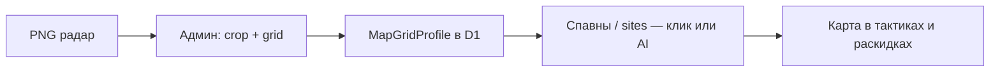

# Сетка карты и универсальные координаты для тактик

> Документ-идея: как загружать **любую** новую карту и строить тактики в **ручном** и **AI-авто** режиме без переписывания кода под каждый `de_*`.
>
> Связанные файлы: `PLAN_TEAM_TACTICS.md`, `UI_UX_TACTICS_VISION.md`, `src/data/maps.json`, `src/types/tactics.ts`, `TacticMapView.tsx`.

---

## 1. Проблема сейчас

| Что есть | Ограничение |
|----------|-------------|
| `MapPoint { x, y }` в диапазоне **0..1** | Работает только если радар вписан в `object-fit: contain` и все слои совпадают |
| `maps.json`: `calibration` (pos_x, pos_y, scale) | Есть для раскидок, **не используется** в тактиках |
| Радар: `/minimaps/{file}.png` | Нужен ручной PNG на диск; без файла карта пустая |
| Тактики в `tactics.json` | Жёстко привязаны к `de_mirage` и ручным координатам |
| AI | Нет единого формата «опиши раунд → получи path на любой карте» |

**Симптом «карта пропадает»:** сброс `imgLoaded` при смене радара без учёта кэша браузера (`img.complete`) — исправлено в `TacticMapView` по образцу `MapView`.

---

## 2. Цель продукта

1. **Любая карта** — загрузил радар (и опционально слои) → система сама даёт сетку, зоны, spawns/sites.
2. **Два режима редактора тактик:**
   - **Ручной** — рисуешь маршруты, точки, зоны на сетке; привязка к ролям и шагам.
   - **Авто (AI)** — текст/voice брифинг → модель возвращает структуру `Tactic` в координатах сетки.
3. **Один источник правды** для раскидок и тактик: нормализованные координаты + калибровка мира CS2.
4. **Слои** (Nuke lower/main) — переключение без потери координат внутри слоя.

---

## 3. Модель координат (три слоя)

```text
┌─────────────────────────────────────────────────────────┐
│  Layer C — UI (пиксели SVG поверх радара)               │
│    x_px = gridNorm.x * radarBox.width                   │
├─────────────────────────────────────────────────────────┤
│  Layer B — Grid-normalized (0..1 внутри «игрового»      │
│            прямоугольника радара, без letterbox)        │
│    Используется в tactics.json, AI, редакторе           │
├─────────────────────────────────────────────────────────┤
│  Layer A — World CS2 (pos_x, pos_y)                     │
│    maps.json calibration: world ↔ grid B                │
│    Опционально для синка с демо/консолью в будущем    │
└─────────────────────────────────────────────────────────┘
```

### 3.1. Типы (целевые)

```ts
/** Нормализованная точка на радаре (как сейчас, но явно в Layer B). */
export interface GridPoint {
  x: number // 0..1
  y: number // 0..1
  layer_id?: string // 'main' | 'lower' — для многослойных карт
}

/** Описание карты для редактора и AI. */
export interface MapGridProfile {
  map_id: string
  radar: {
    file: string
    width: number   // натуральный размер PNG
    height: number
    /** Прямоугольник «игровой области» внутри PNG (обрезка пустых полей). */
    crop: { x: number; y: number; w: number; h: number } // 0..1 относительно PNG
  }
  calibration: {
    pos_x: number
    pos_y: number
    scale: number
  }
  /** Равномерная сетка для привязки и AI (например 16×16). */
  grid: {
    cols: number
    rows: number
    /** Подписи зон: A1, mid, B default — опционально. */
    zone_labels?: Record<string, string>
  }
  spawns: { ct: GridPoint; t: GridPoint }
  sites: Record<string, GridPoint>
  layers: Array<{ id: string; label: string; file: string }>
}
```

### 3.2. Миграция с текущего `MapPoint`

- Существующие `path[]` в `tactics.json` **остаются валидными** (это уже Layer B).
- Новые поля добавляются опционально: `layer_id`, `grid_cell`, `world` (если понадобится).

---

## 4. Сетка (Grid)

### 4.1. Зачем

- **AI** проще отвечать «иди в клетку G7, брось в F3», чем сырыми float.
- **Снэп** в ручном редакторе — маршруты ровные, меньше дрожания пальца.
- **Зоны** тактики (exec A / mid control) = union клеток сетки.

### 4.2. Параметры по умолчанию

| Параметр | Значение | Комментарий |
|----------|----------|-------------|
| `cols` × `rows` | 16 × 16 | Баланс точности и простоты для телефона |
| Отображение | полупрозрачная сетка в редакторе | В просмотре плана — выкл |
| Снэп | toggle в UI | Вкл по умолчанию в ручном режиме |

### 4.3. Формулы

```ts
// grid cell → center point (Layer B)
function cellToPoint(col: number, row: number, cols: number, rows: number): GridPoint {
  return {
    x: (col + 0.5) / cols,
    y: (row + 0.5) / rows,
  }
}

// point → cell (для AI output validation)
function pointToCell(p: GridPoint, cols: number, rows: number) {
  return {
    col: Math.min(cols - 1, Math.max(0, Math.floor(p.x * cols))),
    row: Math.min(rows - 1, Math.max(0, Math.floor(p.y * rows))),
  }
}
```

### 4.4. Crop радара

Многие PNG имеют пустые поля. В `MapGridProfile.radar.crop` задаём «активный» прямоугольник:

- Координаты Layer B считаются **относительно crop**, не всего файла.
- `useRadarImageBox` уже даёт `box` на экране — нужно согласовать с crop при отрисовке overlay.

**MVP crop:** вручную в админке «потянуть углы» → сохранить в D1 `map_profiles` JSON.

**Auto crop (позже):** AI vision по PNG → bounding box игровой области.

---

## 5. Загрузка новой карты (onboarding)



### Шаги для пользователя (капитан / админ)

1. Загрузить `radar.png` (и при необходимости `lower.png`).
2. Указать display name, `map_id` (`de_custom_arena` или официальный id).
3. **Калибровка crop** — 4 угла игровой зоны.
4. Расставить **CT/T spawn** и **сайты** (клик на карте или импорт из шаблона похожей карты).
5. (Опционально) **AI assist:** «это похоже на mirage» → копировать spawns/sites с масштабированием.

### Хранение

```ts
// D1 / editor_content key
'map_profiles' → Record<string, MapGridProfile>
```

Официальные карты — seed из `maps.json` + minimaps. Кастом — только через админку.

---

## 6. Режимы создания тактики

### 6.1. Ручной редактор (`/team` → briefing → «Создать тактику»)

| Действие | UX |
|----------|-----|
| Рисование path | drag по карте, снэп к сетке |
| Точка броска | тап → `grenade_marker` |
| Привязка к шагу | timeline слева / снизу, шаг подсвечивается на карте |
| Роли | фильтр слоёв как сейчас `ViewRole` |
| Exec target | одна звезда «цель раунда» (`tactic_overview`) |

Сохранение: `Tactic` в D1 `custom_tactics` (аналог `custom_lineups`).

### 6.2. Авто-режим (AI)

**Вход:** текст или голос (Whisper → текст).

**Промпт-контекст для модели:**

- `MapGridProfile` (grid size, spawns, sites, zone_labels).
- Список ролей и сторона.
- Схема JSON ответа (строгий).

**Пример ответа AI:**

```json
{
  "name": "Default A",
  "side": "t",
  "scenario": "full",
  "tactic_overview": {
    "exec_target": { "x": 0.54, "y": 0.76, "label": "A site" }
  },
  "role_plans": [
    {
      "role": "entry",
      "brief": "Первым на плент",
      "steps": [
        {
          "id": "e1",
          "kind": "move",
          "text": "Смок на окно",
          "path": [{ "x": 0.87, "y": 0.36 }, { "x": 0.75, "y": 0.4 }],
          "grenade_marker": { "x": 0.75, "y": 0.4, "type": "smoke" }
        }
      ]
    }
  ]
}
```

**Валидация на сервере:**

- clamp x,y в 0..1;
- привязка path к сетке (опционально);
- проверка `map_id` и `layer_id`.

**UI:** «Черновик от AI» → капитан правит в ручном редакторе → «Опубликовать».

### 6.3. Гибрид

- AI генерирует черновик → ручная правка точек.
- Ручной path → AI дописывает тексты шагов (`text` по координатам).

---

## 7. Архитектура (модули)

| Модуль | Назначение |
|--------|------------|
| `src/lib/map-grid/` | crop, cell↔point, world↔grid |
| `src/lib/map-grid/profile.ts` | load/save `MapGridProfile` |
| `src/components/map-grid/GridOverlay.tsx` | SVG сетка поверх радара |
| `src/components/tactics/TacticEditor.tsx` | ручной режим |
| `src/app/api/tactics/ai-draft/route.ts` | POST текст → Tactic JSON |
| `src/components/team/TacticMapView.tsx` | просмотр (уже есть) |

**Единый canvas:** `TacticMapCanvas` = радар + crop box + grid + paths — используется в редакторе и в `TacticMapView`.

---

## 8. API (черновик)

| Method | Path | Описание |
|--------|------|----------|
| GET | `/api/maps/[id]/profile` | `MapGridProfile` |
| PUT | `/api/admin/map-profiles` | сохранить crop/grid/spawns |
| POST | `/api/tactics/ai-draft` | `{ map_id, side, prompt }` → `Tactic` |
| GET/POST | `/api/tactics/custom` | CRUD кастомных тактик (D1) |

---

## 9. Фазы внедрения

### Фаза 0 — стабильность (сейчас)

- [x] Фикс `TacticMapView` (кэш изображения, ошибка загрузки).
- [ ] Minimaps в репо / CI assets для всех competitive карт.

### Фаза 1 — сетка и профиль карты

- [ ] Типы `MapGridProfile`, `GridPoint`.
- [ ] `GridOverlay` в `TacticMapView` (debug toggle).
- [ ] Админ-страница: crop + spawns для одной карты.
- [ ] D1 key `map_profiles`, seed из `maps.json`.

### Фаза 2 — ручной редактор тактик

- [ ] `TacticEditor` на `/team/.../edit` или `/admin/tactics`.
- [ ] Сохранение в D1 `custom_tactics`.
- [ ] Выбор тактики в briefing из preset + custom.

### Фаза 3 — AI черновик

- [ ] `/api/tactics/ai-draft` + промпт с grid context.
- [ ] UI «Сгенерировать» на briefing.
- [ ] Ревью и публикация капитаном.

### Фаза 4 — любая новая карта

- [ ] Wizard загрузки PNG + auto-crop (vision).
- [ ] Импорт профиля с похожей карты.
- [ ] Документация для мапмейкеров.

---

## 10. AI: практические ограничения

- Модель **не видит** ваш PNG напрямую в MVP — только **текстовое** описание сетки (spawns, sites, zone_labels). Для точных маршрутов нужен либо vision-шаг (скрин радара в multimodal), либо ручная доводка.
- Рекомендация: AI генерирует **логику и примерные клетки**, игрок **подправляет** path в редакторе (5–10 тапов).
- Промпт хранить в коде версионированно (`prompts/tactic-draft-v1.txt`).

---

## 11. Связь с раскидками

| Сущность | Координаты | Связь |
|----------|------------|--------|
| Grenade / lineup | `position_ids` → hotspot Layer B | Тот же `MapGridProfile` |
| Tactic step `throw` | `grenade_id` + `grenade_marker` | Deep link в `/map/[id]?...` |
| Meet dock | тактика ↔ раскидки | Общий `map_id`, `side` |

Цель: точка на тактике и маркер раскидки — **одна система координат** (Layer B + crop).

---

## 12. Открытые вопросы

1. **Размер сетки** 16×16 vs 24×24 для больших экранов?
2. **Хранить tactics** только в D1 или дублировать preset в JSON для offline?
3. **Realtime** (синхрон карты у всех в meet) — Phase T1 Supabase или Cloudflare Durable Objects?
4. **Локализация** подписей зон в AI-промпте (ru/en)?

---

## 13. Резюме для команды

> Загружаем радар → получаем **профиль карты с сеткой** → в **ручном** редакторе рисуем тактику по клеткам → или **AI** набрасывает черновик по тексту брифинга → капитан правит → команда видит ту же карту в `/team` без пропаданий и с быстрым переходом к раскидкам.

Следующий практический шаг после этого документа: **Фаза 1** — `MapGridProfile` + overlay сетки в `TacticMapView` + админ crop для Mirage как эталон.
